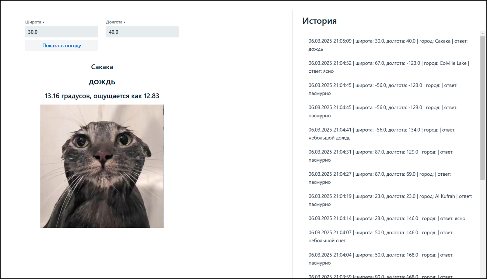
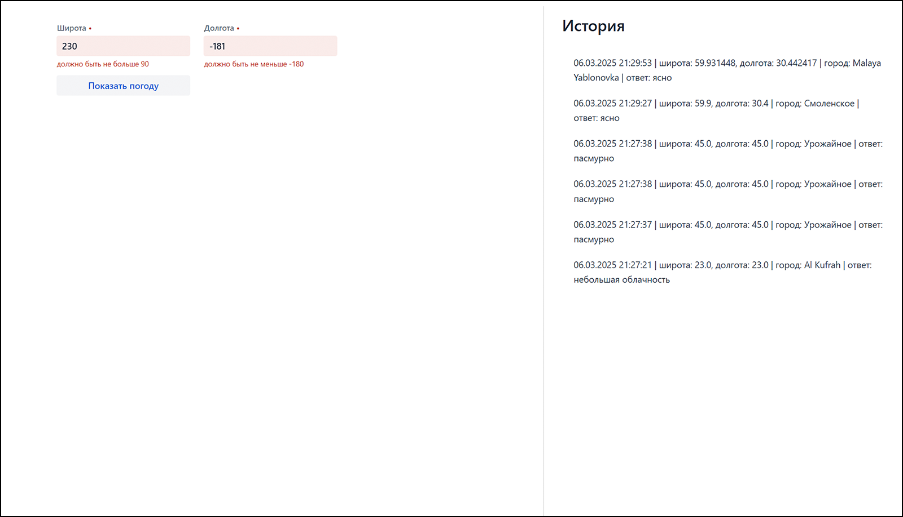

### Запуск проекта
Склонируйте проект `git clone https://github.com/sparklemod/weather-visualizer.git`

Перейдите в корневую папку проекта и выполните команду `docker-compose up -d --build`

Откройте http://localhost:8080/

Примеры

Валидация

